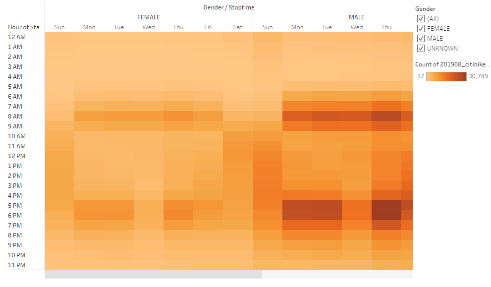
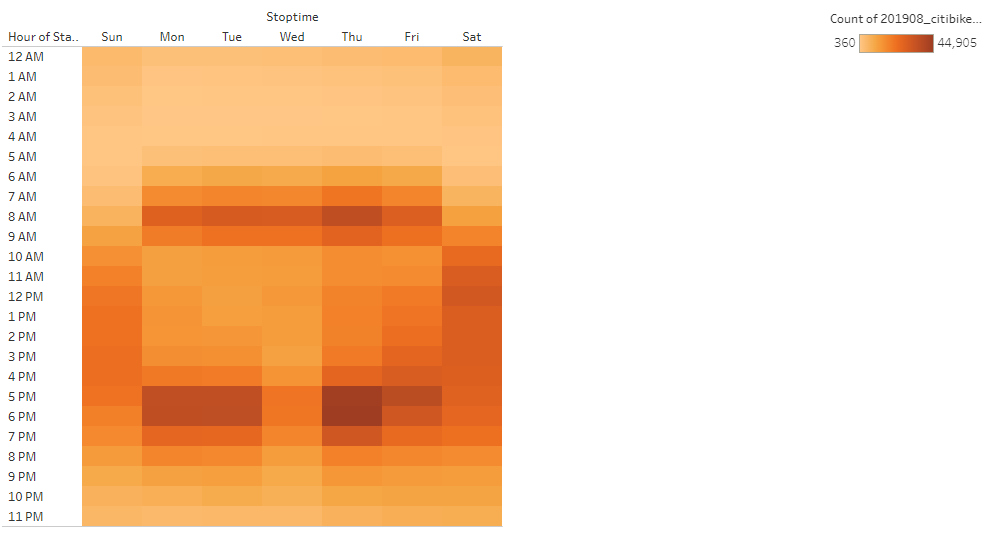
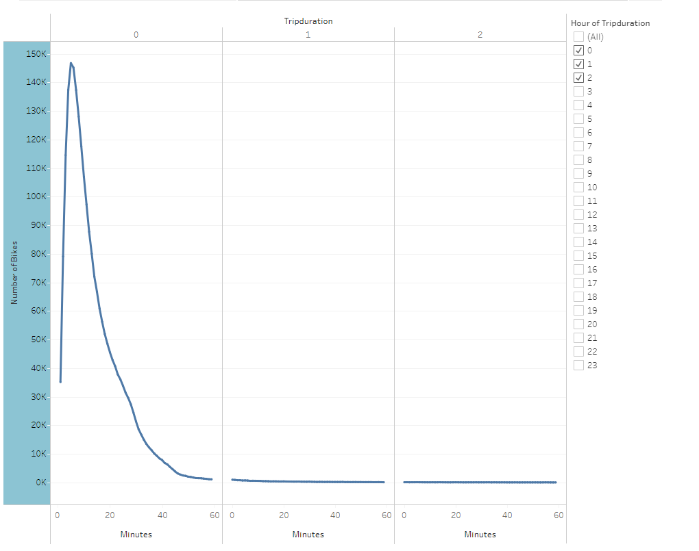
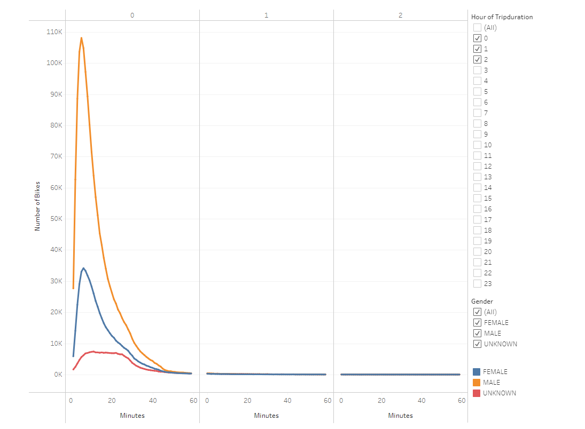
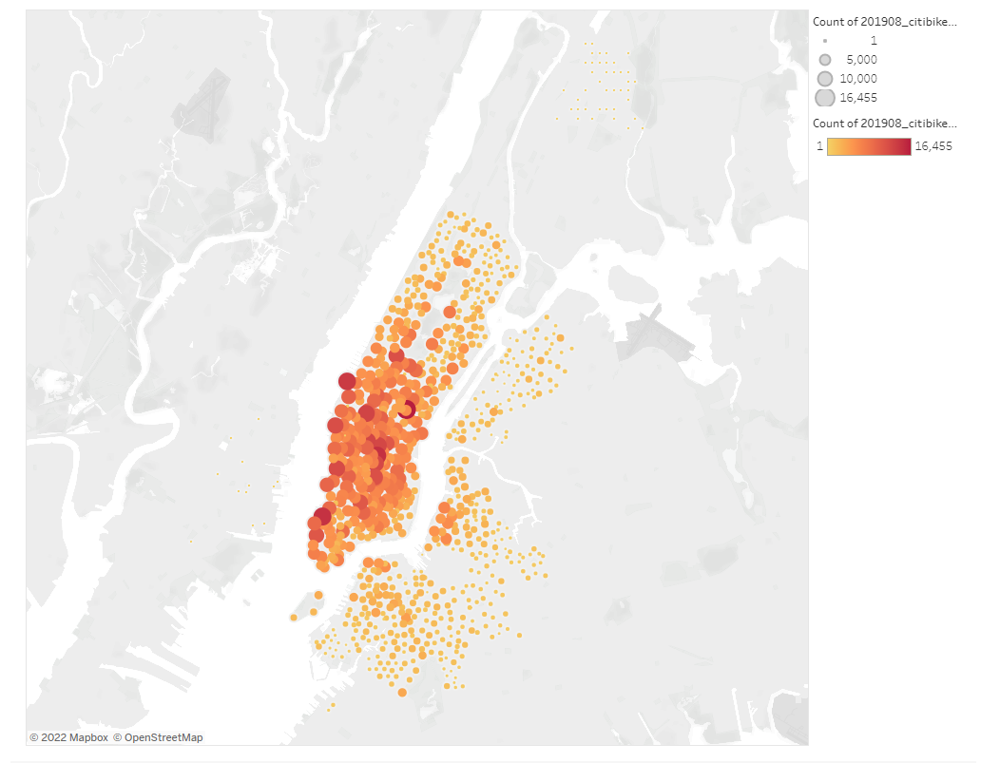

# Bikesharing Program in Des Moines, Iowa

## Overview of Project

### Purpose
The purpose of this project is to convince investors that a bike-sharing program in Des Moines is a solid business proposal.

## Results
From this analysis, we can conclude seven major points:
     * According to a report in August of 2019, the number of bike rides totaled 2,344,244. The bikesharing industry is huge and is eliminating the use of car riding.  The reason for this is becuase of high gas prices and cars also burns fossil fuel which creates air pollution.
     
     
     * This chart shows how exciting males and females are with having bikesharing opportunities in Des Moines, Iowa.  Des Moines, Iowa is in the top ten states with the best healthcare and creating a bikesharing program in the city leads to a longer and healthier life.
     
     
     * Cycling is the most economical method of transportation for short and medium-distance trips in metropolitan urban areas. Previously, cycling used to be viewed as a recreation movement and not a method of transportation for your daily commute.
     
     
     * As far as the financial part of going to work during the day as the graph shows, driving versus cycling creates frustration and anxiety because of high volumes of traffic. Yet, with cycling, it is cheap and advantageous. Cycling prompts a quicker open transportation with a decrease in vehicle traffic.
     
     
     * Cycling is easy and fun. So during one hour of the day, the cyclist is less stressful and more relaxed.
     
     
     * Cycling empowers social communication in light of the fact that the male bikerider is continually in a hurry and many utilize this experience for cardio for the rec center.
      
     
     * Taking everything into account, this bicycle ridership diagram shows a positive effect that the city of Des Moines, Iowa will experienced through the  personal satisfaction, the experience of happiness and the improvement to public transportation.
     

## Summary
Bikesharing will benefit the people of Des Moines, Iowa and if the program caters to males during the morning it will be very successful.
Bikesharing will increase ridership overall and will prove to be a successful business opportunity for the city.

